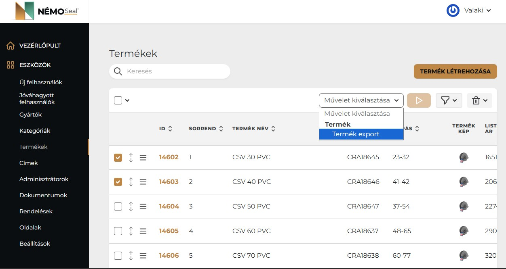
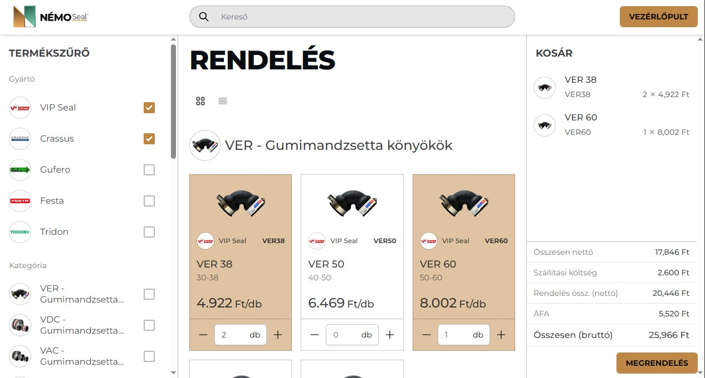

### Némó Seal, webáruház csöveseknek. Mármint csőszerelőknek.
A shop Laravel alapon, 2023 körül készült.  
Az admin termékeket, ügyfeleket, rendeléseket kezel, van minden ami kellhet.  
Egyedi árazás ügyfélcsoportonként, exportok, importok, Egyszerű CMS is.  
 
 
Az ügyfél beléphet, fiókjában láthatja a szokásos dolgokat, adatok, rendelések stb..  
Frontenden rendelhet, sokat.  
 
 
Rendeléskor az érintettek mailt kapnak, melyben csatolmányként PDF-et is megy a rendelésről, ilyesmi: 
[PDF a rendelésről](public/storage/pdf/Rendelés_100.pdf) 
 
Hát ennyi.  
